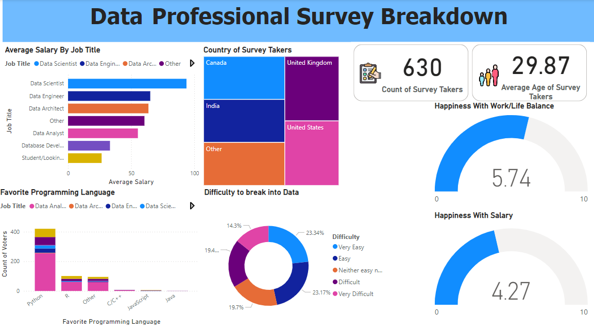

# Data-Professional-Survey
## Introduction:

---
This is a power Bi project on a survey that was taken from Data professionals on several social media platforms like linkedIN, X(Twitter) and so on.

## Skills/ concepts demonstrated:
The following Power Bi features were incorporated- quick measures, Power query , filters, tooltips , Button.

## Problem statement:
1. What is the average salary for each role in Data?
2. What is the favorite programming language of Data Professionals?
3. How difficult is it to break into Data?
4. How does your country of residence reflect on your salary as a data professional?
5. How happy are Data professionals with their salary?
6. How happy are Data professionals with their Work/Life balance?

## Visualization :

## Analysis :
 +  A total of 630 data professionals took the survey.
 +  Data professionals from every continent took this survey.
 +  The average age of data professionals in this survey is 29.87.
   ## Conclusion :
 +  Python is the favorite programming language of Data professionals.
 +  Less than half of Data professionals are happy with their salary.
 +  More than half of Data professionals are happy with their Work/Life balance.
 +  It is easy to break into Data.
   
